# Wesley Quintero - Professional Portfolio

A modern, responsive portfolio website showcasing my skills, projects, and professional experience as a Data-Driven Amazon & E-commerce Specialist.



## Features

- 🎨 Modern UI with dark/light mode
- 📱 Fully responsive design
- 🛠️ Interactive Amazon seller tools
- 📊 Project showcase with filtering
- 📝 Blog section with MDX content
- 📜 Certifications display
- 📫 Contact form

## Technologies Used

- Next.js 14 (App Router)
- React 18
- TypeScript
- Tailwind CSS
- shadcn/ui components
- MDX for blog content
- Lucide React icons
- Vercel hosting

## Projects

- [SellSmart Hub](https://sellsmart-hub.vercel.app/) - AI-powered analytics and automation tools for Amazon sellers
- [DevFlowDB](https://devflowdb.vercel.app/) - Lightweight WASM-powered SQL database
- [Inventory Management](https://sellsmart-docs.vercel.app/) - Streamlined listing management & account health
- [FBA Department Operations](https://sellsmart-docs.vercel.app/) - Comprehensive training & workflow planning
- [SellSmart Design x Docs](https://sellsmart-docs.vercel.app/) - Design system documentation
- [Wholesale Buyer's Guide](https://sellsmart-docs.vercel.app/) - Client engagement & inventory management

## Blog

The portfolio includes a fully-featured blog with MDX support:
- Static generation of blog pages
- Custom SVG illustrations for each post
- Rich typography with Tailwind Typography
- Code syntax highlighting
- Responsive design for all devices

## Getting Started

1. Clone the repository

```bash
git clone https://github.com/johnwesleyquintero/portfolio.git
cd portfolio
```

2. Install dependencies
```bash
pnpm install
```

3. Start development server
```bash
pnpm dev
```

4. Open http://localhost:3000 in your browser

## Development

To contribute to this project:

1. Fork the repository
2. Create a new branch (`git checkout -b feature/your-feature`)
3. Commit your changes (`git commit -m 'Add some feature'`)
4. Push to the branch (`git push origin feature/your-feature`)
5. Open a Pull Request

## Deployment

This project is automatically deployed to Vercel when pushing to the main branch. For manual deployment:

1. Install Vercel CLI
```bash
pnpm add -g vercel
```

2. Run deployment
```bash
vercel
```

## Environment Variables

Copy `.env.example` to `.env` and update with your own values:
```bash
cp .env.example .env
```
## Available Scripts

- `pnpm dev`: Starts development server
- `pnpm build`: Creates production build
- `pnpm start`: Runs production server
- `pnpm lint`: Runs ESLint
- `pnpm format`: Formats code with Prettier

## Tech Stack Details

- **Next.js 14**: App Router, Server Components, Streaming
- **TypeScript**: Strict typing throughout the project
- **Tailwind CSS**: Utility-first CSS with dark/light mode support
- **shadcn/ui**: Accessible, customizable components
- **MDX**: Markdown with React component support

## Tools Documentation

| Tool Name                  | Status       | Description                                      |
|----------------------------|--------------|--------------------------------------------------|
| ACoS Calculator            | Functional   | Calculates Advertising Cost of Sales for campaigns |
| Sales Estimator            | Needs Implementation | Estimates sales volume and revenue with confidence indicators |
| Keyword Deduplicator       | Functional   | Identifies and removes duplicate keywords         |
| Description Editor         | Needs Implementation | Rich text editor for Amazon product descriptions |
| PPC Campaign Auditor       | Functional   | Analyzes and optimizes PPC campaign performance   |
