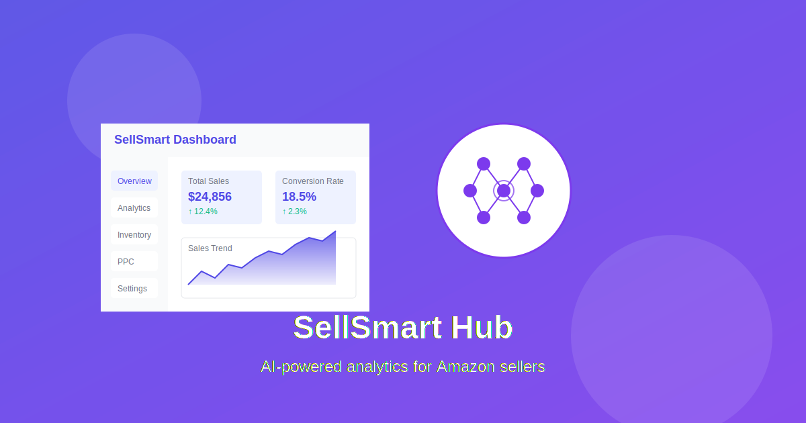

# Wesley Quintero - Professional Portfolio

A modern, responsive portfolio website showcasing my skills, projects, and professional experience as a Data-Driven Amazon & E-commerce Specialist.



## Features

- 🎨 Modern UI with dark/light mode
- 📱 Fully responsive design
- 🛠️ Interactive Amazon seller tools
- 📊 Project showcase with filtering
- 📝 Blog section with MDX content
- 📜 Certifications display
- 📫 Contact form

## Technologies Used

- Next.js 14 (App Router)
- React 18
- TypeScript
- Tailwind CSS
- shadcn/ui components
- MDX for blog content
- Lucide React icons
- Vercel hosting

## Projects

- [SellSmart Hub](https://sellsmart-hub.vercel.app/) - AI-powered analytics and automation tools for Amazon sellers
- [DevFlowDB](https://devflowdb.vercel.app/) - Lightweight WASM-powered SQL database
- [Inventory Management](https://sellsmart-docs.vercel.app/) - Streamlined listing management & account health
- [FBA Department Operations](https://sellsmart-docs.vercel.app/) - Comprehensive training & workflow planning
- [SellSmart Design x Docs](https://sellsmart-docs.vercel.app/) - Design system documentation
- [Wholesale Buyer's Guide](https://sellsmart-docs.vercel.app/) - Client engagement & inventory management

## Blog

The portfolio includes a fully-featured blog with MDX support:
- Static generation of blog pages
- Custom SVG illustrations for each post
- Rich typography with Tailwind Typography
- Code syntax highlighting
- Responsive design for all devices

## Getting Started

1. Clone the repository

```bash
git clone https://github.com/johnwesleyquintero/portfolio.git
cd portfolio

