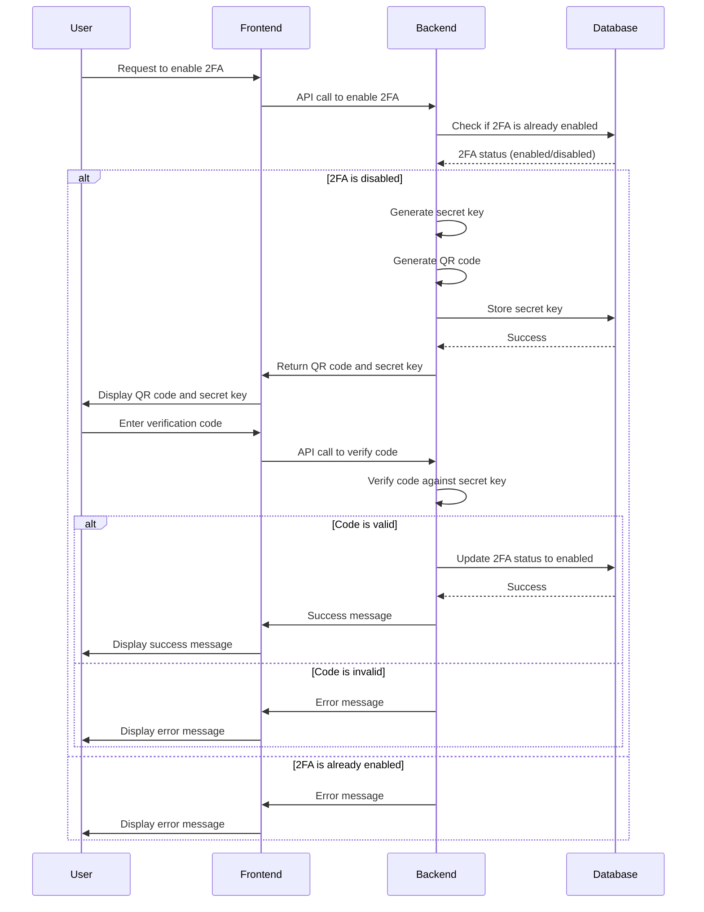
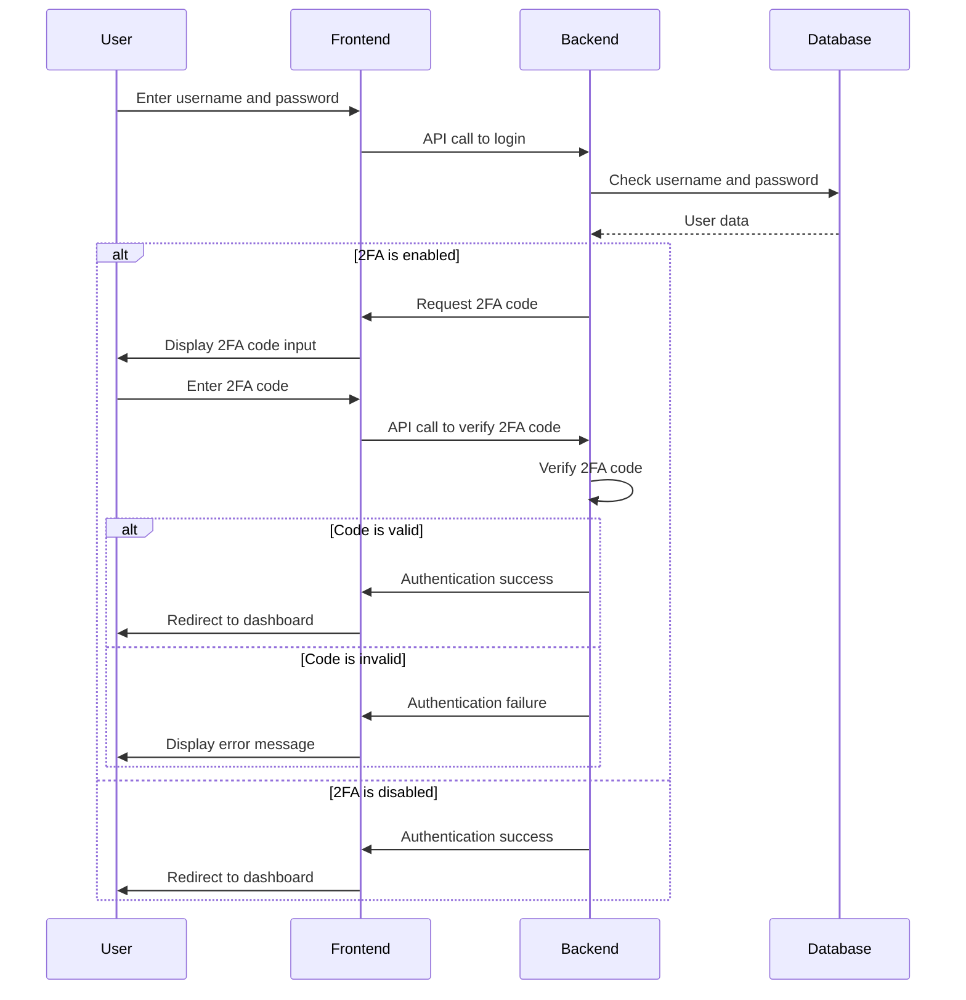

# Two-Factor Authentication Implementation Plan

## 1. Gather Information and Clarify Requirements:

- Examine the existing codebase to understand the current authentication mechanism.
- Identify the technologies and frameworks used in the project.
- Determine the target user base and their technical proficiency.
- Clarify specific requirements, such as compliance standards or preferred 2FA methods.

## 2. Define Authentication Methods:

- Evaluate suitable 2FA methods based on security, usability, and cost.
- Consider SMS-based authentication, authenticator apps (e.g., Google Authenticator, Authy), and email-based verification.
- Research and select appropriate third-party libraries or services for implementing each method.

## 3. Design User Interface:

- Create wireframes and mockups for the 2FA setup and management screens.
- Design a clear and intuitive process for enabling 2FA, linking devices, and generating recovery codes.
- Develop UI components for displaying 2FA status, managing trusted devices, and handling 2FA-related errors.

## 4. Plan Backend Implementation:

- Define database schema changes to store 2FA-related user data (e.g., secret keys, backup codes, trusted devices).
- Design API endpoints for enabling 2FA, verifying codes, generating recovery codes, and managing trusted devices.
- Implement server-side logic for generating and verifying 2FA codes, handling rate limiting, and managing user sessions.

## 5. Address Security Considerations:

- Implement measures to prevent brute-force attacks on 2FA codes (e.g., rate limiting, account lockout).
- Develop a process for handling lost 2FA devices or recovery codes (e.g., account recovery via email or phone).
- Implement security best practices for storing and transmitting 2FA secrets (e.g., encryption, secure storage).

## 6. Develop Testing Strategy:

- Create a comprehensive test plan covering all aspects of the 2FA implementation.
- Conduct unit tests to verify the correctness of individual components and functions.
- Perform integration tests to ensure seamless interaction between different parts of the system.
- Conduct user acceptance testing (UAT) to validate the usability and effectiveness of the 2FA implementation.
- Perform security testing to identify and address potential vulnerabilities.

## 7. Mermaid Diagrams:

### 2FA Setup Process:

### 2FA Login Process:

