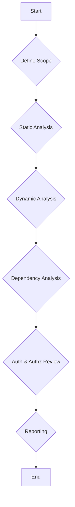

# Security Audit Plan

**Project:** Wesley Quintero - Professional Portfolio

**Objective:** Conduct a comprehensive security audit, with a primary focus on the Amazon seller tools suite.

**Scope:**

- **Amazon Seller Tools:**
  - ACoS Calculator
  - PPC Campaign Auditor
  - Description Editor
  - Keyword Deduplicator
  - Competitor Analyzer
  - Product Score Calculation tool
  - Optimal Price Calculator
- **Authentication and Authorization:** API key management for accessing the tools.
- **Data Validation:** Input validation for all tool parameters and CSV uploads.
- **Dependencies:** Review of third-party libraries used by the tools.

**Methodology:**

1.  **Static Analysis:**
    - Review source code for potential vulnerabilities (e.g., injection flaws, insecure data handling).
    - Use automated static analysis tools (if available) to identify common security issues.
    - Examine data validation routines to ensure proper sanitization and input validation.
2.  **Dynamic Analysis:**
    - Test the tools with various inputs, including malicious or unexpected data, to identify vulnerabilities.
    - Analyze the tools' behavior and responses to identify potential security flaws.
    - Monitor network traffic to identify any sensitive data being transmitted insecurely.
3.  **Dependency Analysis:**
    - Identify all third-party dependencies used by the Amazon seller tools.
    - Check for known vulnerabilities in these dependencies using vulnerability databases and tools.
    - Evaluate the risk associated with each vulnerability and prioritize remediation efforts.
4.  **Authentication and Authorization Review:**
    - Analyze the API key management system to ensure secure generation, storage, and revocation of keys.
    - Verify that proper authorization checks are in place to prevent unauthorized access to the tools.

**Timeline:**

- **Phase 1: Static Analysis (3 days)**
  - Code review of Amazon seller tools and related components.
  - Automated static analysis (if applicable).
  - Data validation review.
- **Phase 2: Dynamic Analysis (3 days)**
  - Testing with various inputs.
  - Behavior analysis.
  - Network traffic monitoring.
- **Phase 3: Dependency Analysis (1 day)**
  - Identify and analyze third-party dependencies.
  - Vulnerability scanning.
- **Phase 4: Authentication and Authorization Review (1 day)**
  - API key management analysis.
  - Authorization checks verification.
- **Phase 5: Reporting (2 days)**
  - Document findings and recommendations.
  - Prepare a security audit report.

**Resources:**

- **Personnel:** Security Architect (myself)
- **Software:**
  - Static analysis tools (if available)
  - Vulnerability scanning tools
  - Network monitoring tools
- **Documentation:**
  - Project documentation (README.md, etc.)
  - Third-party library documentation
  - Security best practices guidelines

**Deliverables:**

- Security Audit Report: A comprehensive report outlining the findings of the security audit, including identified vulnerabilities, their potential impact, and recommendations for remediation.

**Potential Risks:**

- Lack of access to necessary tools or resources.
- Unexpected complexities in the codebase.
- Time constraints.

**Mermaid Diagram:**

