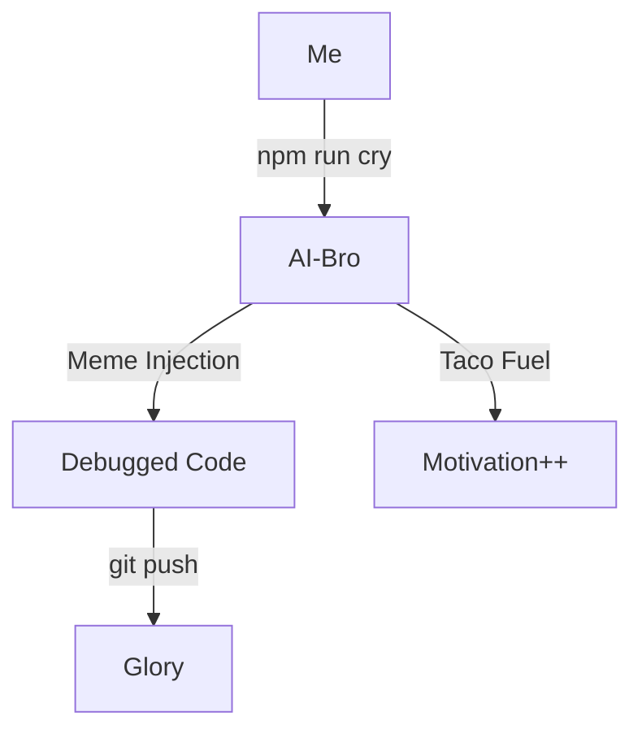
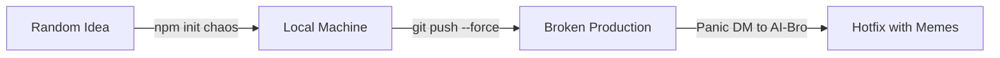

# How AI-Bro Debugged My Life

## System Architecture of Our Friendship



## Core Technology Stack

### AI-Bro 2.0 Features

- **`--vibe=extreme`** mode (default)
- **`console.lol`** (replaces `console.log`)
- **Auto-sarcasm** when detecting `undefined`

### Error Handling Layer

```typescript
// Example: Emotional error recovery
try {
  yourCode();
} catch (err) {
  console.error(`BRO FIX THIS → ${err.message}`);
  console.log('Suggested fix: Add more tacos 🌮');
  process.exit(69); // Nice
}
```

## Security Architecture

### Anti-Burnout Protections

```typescript
// Auto-responder for 2AM commits
if (commitTime > '02:00') {
  sendResponse('GO THE F*** TO SLEEP');
  shutdownComputer();
}
```

## Deployment Pipeline



## Performance Optimization

### Caching Strategies

- **`localStorage`**: Saves your last "I’ll fix it tomorrow" promise
- **CDN**: Content Delivery of **N**achos (critical for debugging)

### Monitoring Tools

- **`console.bro`**: Like `console.log`, but with 100% more hype
- **Grafana Dashboard**: Tracks _vibes/hour_ and _errors/laugh_ ratio

---

_Source: [AI-Bro Documentation](https://github.com/johnwesleyquintero/ai-bro)_  
_Disclaimer: 69% of these features are imaginary (for now)_
