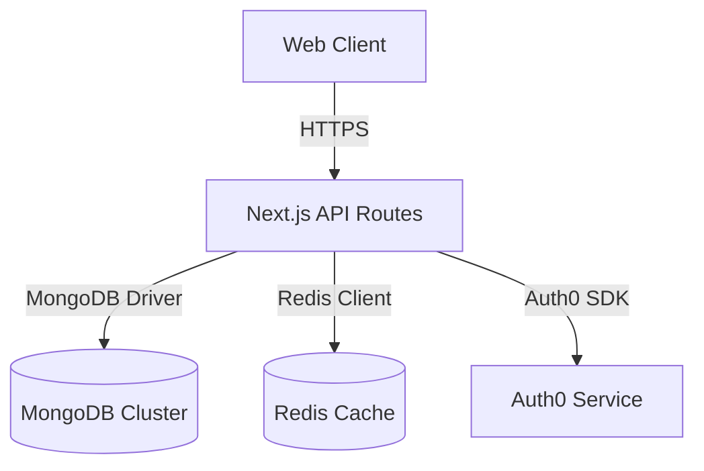
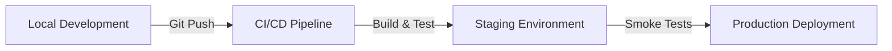

## System Architecture Diagram



## Core Technology Stack

### Next.js 14 Features

- App Router for route management
- Streaming server components
- Incremental Static Regeneration

### Database Layer

```typescript
// Example MongoDB schema definition
type UserProfile = {
  _id: string;
  email: string;
  preferences: Record<string, any>;
  createdAt: Date;
};
```

### Redis Cache Patterns

- Session storage with JSON serialization
- Rate limiting buckets
- API response caching

## Security Architecture

### Middleware Protections

```typescript
// Example authentication middleware
export async function middleware(req: NextRequest) {
  const session = await getSession(req);
  if (!session) {
    return new Response('Unauthorized', { status: 401 });
  }
}
```

### Key Security Features

- JWT validation with HS512
- CSP headers configuration
- Rate-limited API endpoints

## Deployment Pipeline



## Performance Optimization

### Caching Strategies

- CDN edge caching
- Database query caching
- Client-side hydration caching

### Monitoring Tools

- Prometheus metrics collection
- Grafana dashboard integration
- Log aggregation with ELK Stack

---

_Source: [Application Architecture Documentation](https://example.com/architecture)_
