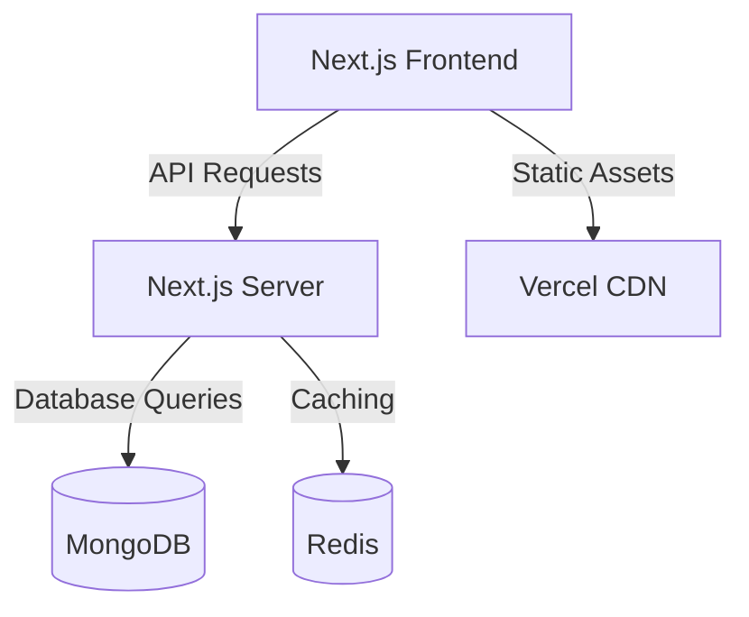
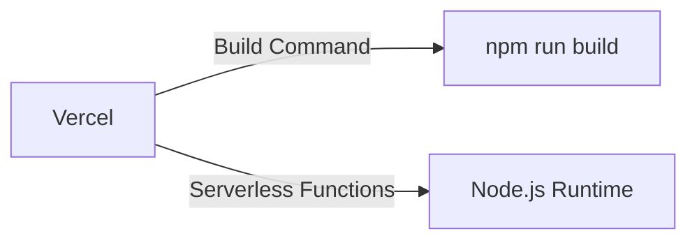

# Application Architecture Documentation

## Client-Server Architecture

## Key Components

### Frontend Structure

- App Router with React Server Components
- Shadcn/ui component library
- Tailwind CSS styling system
- Client-side state management using React Context

### Backend Services

- Next.js API routes handling:
  - Authentication (Next-Auth)
  - Data mutations
  - Third-party API integrations
- Middleware chain:
  - Rate limiting
  - Request validation
  - Security headers

### Data Layer

- MongoDB: Primary data store
- Redis: Session storage and caching
- Zod: Data validation schema

### Deployment

- Vercel platform configuration
- Environment variables:
  - `MONGODB_URI`: Database connection
  - `REDIS_URL`: Cache connection
  - `NEXTAUTH_SECRET`: Auth encryption

